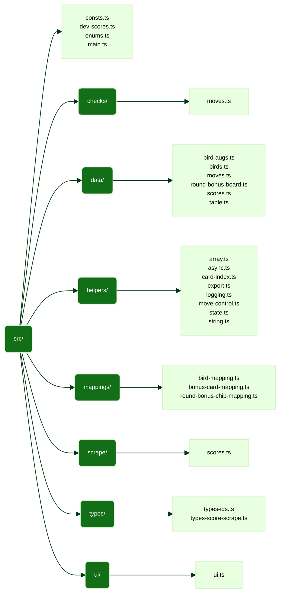

# Architecture

This document describes the high-level architecture of this TypeScript-based
Firefox extension project. If you're trying to familiarize yourself with the
codebase, this is the place to start!

<!-- toc -->

- [High-Level Description](#high-level-description)
- [Tooling](#tooling)
- [Code Map](#code-map)
  * [Directory Structure](#directory-structure)
  * [Code Semantics](#code-semantics)

<!-- tocstop -->

## High-Level Description

...

## Tooling

- TypeScript
- Webpack
- Prettier

## Code Map

### Directory Structure

<!-- mermaid-fs-diagram -->

<!-- mermaid-fs-diagram-stop -->

### Code Semantics
